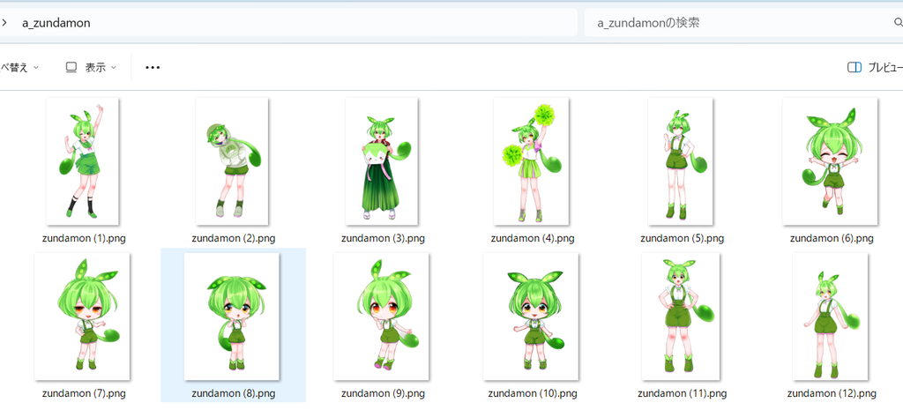
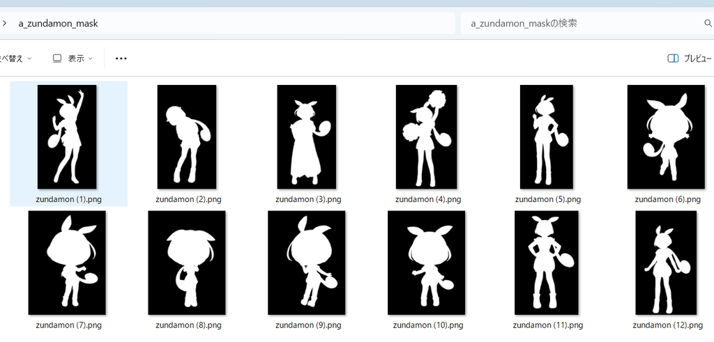
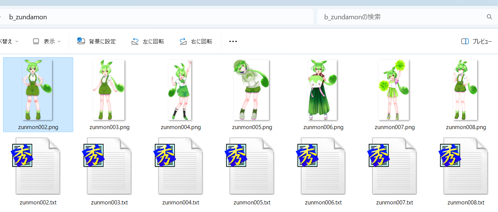

masked_loss.md
## 关于掩码损失
掩码损失是一种通过输入图像的掩码来指定部分区域进行损失计算，从而实现仅对图像的特定部分进行训练的功能。例如，当你想训练一个角色时，可以通过仅对角色部分进行掩码来忽略背景的影响。
掩码损失有两种指定掩码的方法：
- 使用掩码图像
- 使用透明度（Alpha通道）
本文档的示例使用了  中的“AI图像模型用训练数据”。
### 使用掩码图像的方法
这种方法需要为每张训练图像准备对应的掩码图像。掩码图像应与训练图像具有相同的文件名，并存储在不同的目录中。
- 训练图像
  
- 掩码图像
  
```toml
[[datasets.subsets]]
image_dir = "/path/to/a_zundamon"
caption_extension = ".txt"
conditioning_data_dir = "/path/to/a_zundamon_mask"
num_repeats = 8
```
掩码图像应与训练图像大小相同，其中需要训练的区域用白色表示，不需要训练的区域用黑色表示。该功能支持灰度掩码（例如，值为127的像素对应的损失权重为0.5）。实际上，掩码图像的R通道将被使用。
对于DreamBooth方式的数据集，你需要将掩码图像保存在`conditioning_data_dir`指定的目录中。有关更多详细信息，请参考 [ControlNet-LLLite](./train_lllite.md)。
### 使用透明度（Alpha通道）的方法
这种方法使用训练图像的透明度（Alpha通道）作为掩码。透明度为0的区域将被忽略，而透明度为255的区域将被用于训练。对于半透明区域，其损失权重将根据其透明度进行调整（例如，透明度为127的像素对应的损失权重约为0.5）。

*上述图像均为PNG格式并带有透明通道*
在训练时，你需要在脚本的选项中添加`--alpha_mask`，或者在数据集的配置文件中的subset部分设置`alpha_mask`。例如：
```toml
[[datasets.subsets]]
image_dir = "/path/to/image/dir"
caption_extension = ".txt"
num_repeats = 8
alpha_mask = true
```
## 训练时的注意事项
- 目前仅支持DreamBooth方式的数据集。
- 掩码将在latents尺寸（即原始图像的1/8）下应用。因此，细小的部分（例如刘海或耳环等）可能无法被很好地训练。你可能需要对掩码进行一些调整，比如稍微扩大掩码区域。
- 使用掩码损失时，可能不需要在图像的描述文本中包含不被掩码的部分。（待验证）
- 当使用`alpha_mask`时，切换掩码的有无将自动重新生成latents缓存。