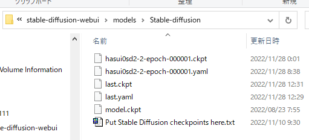

DreamBooth指南

请同时参考关于训练的共同文档。

# 概要

DreamBooth是一种技术，通过对图像生成模型进行特定主题的额外训练，并使用特定的标识符生成图像。[相关论文在此](https://arxiv.org/abs/2208.12242)。

具体来说，可以让Stable Diffusion模型学习特定的角色或绘画风格等，并通过像 `shs` 这样的特定单词来调用（使之出现在生成的图像中）。

该脚本基于[Diffusers的DreamBooth](https://github.com/huggingface/diffusers/tree/main/examples/dreambooth)，但添加了以下功能（其中一些功能后来也被原脚本支持）。

脚本的主要功能如下：

- 通过8位Adam优化器和潜在变量缓存来减少内存使用（与[Shivam Shrirao氏版](https://github.com/ShivamShrirao/diffusers/tree/main/examples/dreambooth)类似）。
- 通过xformers减少内存使用。
- 不仅支持512x512，还支持任意大小的训练。
- 通过数据增强提高质量。
- 不仅支持DreamBooth，还支持Text Encoder+U-Net的微调。
- 以Stable Diffusion格式读写模型。
- 支持长宽比存储桶（Aspect Ratio Bucketing）。
- 支持Stable Diffusion v2.0。

# 训练步骤

请事先参考本仓库的README，进行环境准备。

## 数据准备

请参考[关于训练数据准备](./train.md)。

## 执行训练

运行脚本。以下是最大限度减少内存使用的命令示例（实际上应该在一行中输入）。请根据需要修改每一行。大约12GB的VRAM似乎可以运行。

```
accelerate launch --num_cpu_threads_per_process 1 train_db.py 
    --pretrained_model_name_or_path=<.ckpt或.safetensors或Diffusers格式的模型目录> 
    --dataset_config=<数据准备时创建的.toml文件> 
    --output_dir=<训练后的模型输出目录>  
    --output_name=<训练后的模型输出文件名> 
    --save_model_as=safetensors 
    --prior_loss_weight=1.0 
    --max_train_steps=1600 
    --learning_rate=1e-6 
    --optimizer_type="AdamW8bit" 
    --xformers 
    --mixed_precision="fp16" 
    --cache_latents 
    --gradient_checkpointing
```

通常，`num_cpu_threads_per_process` 设置为1似乎比较合适。

在 `pretrained_model_name_or_path` 中指定用于额外训练的基础模型。可以指定Stable Diffusion的检查点文件（`.ckpt` 或 `.safetensors`）、Diffusers的本地磁盘上的模型目录或Diffusers的模型ID（例如"stabilityai/stable-diffusion-2"）。

在 `output_dir` 中指定训练后的模型的保存目录。在 `output_name` 中指定模型的文件名（不包括扩展名）。`save_model_as` 用于指定以safetensors格式保存模型。

在 `dataset_config` 中指定 `.toml` 文件。文件内的批量大小最初应设置为 `1` 以减少内存消耗。

`prior_loss_weight` 是正则化图像损失的权重。通常指定为1.0。

将训练步数 `max_train_steps` 设置为1600。这里将学习率 `learning_rate` 指定为1e-6。

为了减少内存使用，指定 `mixed_precision="fp16"`（对于RTX30系列及以后，可以指定 `bf16`。请与在环境准备时对accelerate进行的设置保持一致）。同时指定 `gradient_checkpointing`。

为了使用内存消耗较少的8位AdamW作为优化器（使模型适应学习数据），指定 `optimizer_type="AdamW8bit"`。

指定 `xformers` 选项以使用xformers的CrossAttention。如果未安装xformers或出现错误（在某些环境下，例如 `mixed_precision="no"`），可以改为指定 `mem_eff_attn` 选项以使用节省内存的CrossAttention（速度会变慢）。

为了减少内存使用，指定 `cache_latents` 选项以缓存VAE的输出。

如果有足够的内存，可以编辑 `.toml` 文件，将批量大小增加到例如 `4`（可能会提高速度和准确性）。同时，移除 `cache_latents` 可以启用数据增强。

### 常用选项

在以下情况下，请参考[训练的共同文档](./train.md)中的“常用选项”。

- 训练Stable Diffusion 2.x或其衍生模型
- 训练clip skip为2或以上的模型
- 使用超过75个标记的标题进行训练

### 关于DreamBooth的训练步数

在本脚本中，为了减少内存使用，每步的训练次数是原脚本的一半（将目标图像和正则化图像分成不同的批次进行训练）。

为了与原始Diffusers版本或XavierXiao的Stable Diffusion版本进行几乎相同的训练，请将训练步数加倍。

（由于在汇总学习图像和正则化图像后进行shuffle，数据的顺序会发生变化，但对训练的影响应该不大。）

### 关于DreamBooth的批次大小

由于需要训练整个模型，内存消耗会比LoRA等训练方法更多（与微调相同）。

### 关于学习率

Diffusers版本使用5e-6，而Stable Diffusion版本使用1e-6，因此在上面的示例中使用1e-6。

### 使用旧式数据集指定时的命令行

指定分辨率和批次大小作为选项。命令行示例如下：

```
accelerate launch --num_cpu_threads_per_process 1 train_db.py 
    --pretrained_model_name_or_path=<.ckpt或.safetensors或Diffusers格式的模型目录> 
    --train_data_dir=<训练数据目录> 
    --reg_data_dir=<正则化图像目录> 
    --output_dir=<训练后的模型输出目录> 
    --output_name=<训练后的模型输出文件名> 
    --prior_loss_weight=1.0 
    --resolution=512 
    --train_batch_size=1 
    --learning_rate=1e-6 
    --max_train_steps=1600 
    --use_8bit_adam 
    --xformers 
    --mixed_precision="bf16" 
    --cache_latents
    --gradient_checkpointing
```

## 用训练好的模型生成图像

训练完成后，模型会以指定的名称保存到指定的目录下的safetensors文件中。

对于v1.4/1.5以及其他衍生模型，可以在Automatic1111的WebUI等中使用该模型。请将其放入models\Stable-diffusion目录下。

对于v2.x模型，如果要在WebUI中生成图像，则需要一个描述模型规格的yaml文件。对于v2.x base，需要将v2-inference.yaml放在同一目录下；对于768/v，需要将v2-inference-v.yaml放在同一目录下，并将扩展名之前的部分命名为与模型相同的名称。



各个yaml文件可以在[Stability AI的SD2.0仓库](https://github.com/Stability-AI/stablediffusion/tree/main/configs/stable-diffusion)中找到。

# DreamBooth特有的其他主要选项

关于所有选项，请参考其他文档。

## 不从中间开始训练Text Encoder --stop_text_encoder_training

通过指定stop_text_encoder_training选项和一个数值，可以在达到该步数后停止训练Text Encoder，而只训练U-Net。这可能会提高精度。

（推测可能是Text Encoder先过拟合，通过这种方式可以防止过拟合，但具体影响尚不清楚。）

## 不对Tokenizer进行填充 --no_token_padding

指定no_token_padding选项后，不会对Tokenizer的输出进行填充（与旧版Diffusers的DreamBooth行为相同）。