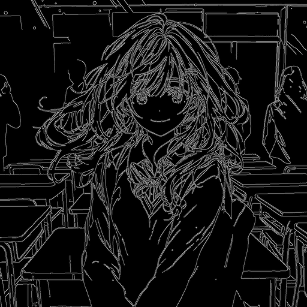
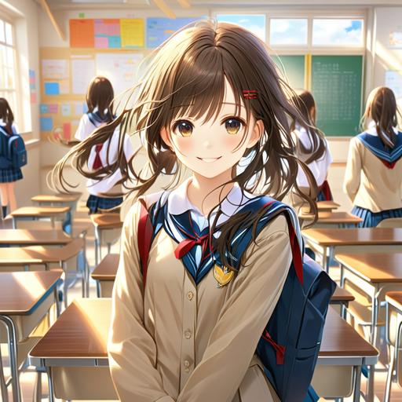
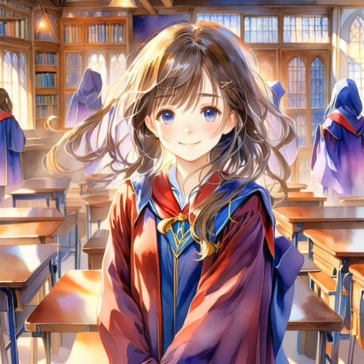
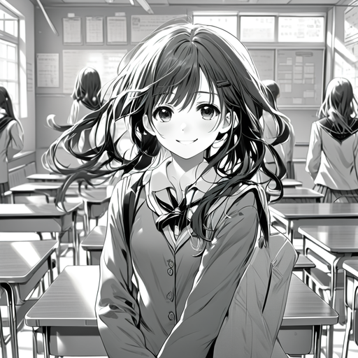

# 关于 ControlNet-LLLite

__由于这是一个非常实验性的实现，因此将来可能会有重大变化。__

## 概要
ControlNet-LLLite 是 [ControlNet](https://github.com/lllyasviel/ControlNet) 的轻量版本。它是 LoRA Like Lite 的缩写，是一种灵感来自 LoRA 的轻量 ControlNet，目前仅支持 SDXL。

## 示例权重文件和推理

请访问：https://huggingface.co/kohya-ss/controlnet-lllite

我们为 ComfyUI 提供了自定义节点：https://github.com/kohya-ss/ControlNet-LLLite-ComfyUI

生成的示例位于本页末尾。

## 模型结构
一个 LLLite 模块由一个将控制图像（以下简称 conditioning image）映射到潜在空间的 conditioning image embedding 和一个类似于 LoRA 的小型网络组成。LLLite 模块与 LoRA 一样被添加到 U-Net 的 Linear 和 Conv 中。详情请参考源代码。

由于推理环境的限制，目前仅添加到 CrossAttention（attn1 的 q/k/v，attn2 的 q）。

## 模型训练

### 准备数据集
使用 DreamBooth 方式的数据集，将 conditioning image 存储在 `conditioning_data_dir` 指定的目录中。

（finetuning 方式的数据集暂不支持。）

conditioning image 必须与训练图像具有相同的 basename，并且会自动调整为与训练图像相同的大小。conditioning image 不需要 caption 文件。

例如，如果使用 caption 文件而不是文件夹名称作为 caption，配置文件如下所示：

```toml
[[datasets.subsets]]
image_dir = "path/to/image/dir"
caption_extension = ".txt"
conditioning_data_dir = "path/to/conditioning/image/dir"
```

目前的限制是不能使用 random_crop。

作为训练数据，最简单的方法是使用原始模型生成的图像作为训练图像，并将其处理后的图像作为 conditioning image，形成合成数据集（尽管数据集的质量可能存在问题）。具体的合成数据集方法将在后面描述。

如果使用与原始模型风格不同的图像作为训练图像，则除了控制外，还需要学习该风格。由于 ControlNet-LLLite 容量较小，不适合风格学习。在这种情况下，请增加后面描述的维度数。

### 训练
如果使用脚本生成，请运行 `sdxl_train_control_net_lllite.py`。可以使用 `--cond_emb_dim` 指定 conditioning image embedding 的维度数，使用 `--network_dim` 指定 LoRA 式模块的秩。其他选项遵循 `sdxl_train_network.py`，但不需要指定 `--network_module`。

训练时内存使用量较大，因此请启用缓存或 gradient checkpointing 等内存减少选项。同时，使用 `--full_bf16` 选项启用 BFloat16 也有效（需要 RTX 30 系列或更高版本的 GPU）。已在 24GB VRAM 上验证。

conditioning image embedding 的维度数在示例 Canny 中指定为 32。LoRA 式模块的秩同样为 64。请根据目标 conditioning image 的特征进行调整。

（示例 Canny 可能相当困难。对于 depth 等，可能可以减少到一半左右。）

下面是 `.toml` 配置示例：

```toml
pretrained_model_name_or_path = "/path/to/model_trained_on.safetensors"
max_train_epochs = 12
max_data_loader_n_workers = 4
persistent_data_loader_workers = true
seed = 42
gradient_checkpointing = true
mixed_precision = "bf16"
save_precision = "bf16"
full_bf16 = true
optimizer_type = "adamw8bit"
learning_rate = 2e-4
xformers = true
output_dir = "/path/to/output/dir"
output_name = "output_name"
save_every_n_epochs = 1
save_model_as = "safetensors"
vae_batch_size = 4
cache_latents = true
cache_latents_to_disk = true
cache_text_encoder_outputs = true
cache_text_encoder_outputs_to_disk = true
network_dim = 64
cond_emb_dim = 32
dataset_config = "/path/to/dataset.toml"
```

### 推理

如果使用脚本生成，请运行 `sdxl_gen_img.py`。可以使用 `--control_net_lllite_models` 指定 LLLite 的模型文件。维度数会自动从模型文件中获取。

使用 `--guide_image_path` 指定推理用的 conditioning image。请注意，不会进行预处理，因此，例如对于 Canny，请指定经过 Canny 处理的图像（黑色背景，白线）。暂不支持 `--control_net_preps`、`--control_net_weights` 和 `--control_net_ratios`。

## 合成数据集的方法

### 生成训练图像

使用基本的模型生成图像。可以使用 Web UI 或 ComfyUI 等生成。图像大小可以使用模型的默认大小（例如 1024x1024）。也可以使用 bucketing，在这种情况下，请以适当的分辨率生成。

生成时的 caption 等应与使用 ControlNet-LLLite 时要生成的图像相匹配。

将生成的图像保存到任意目录，并在数据集配置文件中指定该目录。

本仓库中的 `sdxl_gen_img.py` 也可用于生成。例如，运行以下命令：

```dos
python sdxl_gen_img.py --ckpt path/to/model.safetensors --n_iter 1 --scale 10 --steps 36 --outdir path/to/output/dir --xformers --W 1024 --H 1024 --original_width 2048 --original_height 2048 --bf16 --sampler ddim --batch_size 4 --vae_batch_size 2 --images_per_prompt 512 --max_embeddings_multiples 1 --prompt "{portrait|digital art|anime screen cap|detailed illustration} of 1girl, {standing|sitting|walking|running|dancing} on {classroom|street|town|beach|indoors|outdoors}, {looking at viewer|looking away|looking at another}, {in|wearing} {shirt and skirt|school uniform|casual wear} { |, dynamic pose}, (solo), teen age, {0-1$$smile,|blush,|kind smile,|expression less,|happy,|sadness,} {0-1$$upper body,|full body,|cowboy shot,|face focus,} trending on pixiv, {0-2$$depth of fields,|8k wallpaper,|highly detailed,|pov,} {0-1$$summer, |winter, |spring, |autumn, } beautiful face { |, from below|, from above|, from side|, from behind|, from back} --n nsfw, bad face, lowres, low quality, worst quality, low effort, watermark, signature, ugly, poorly drawn"
```

这是针对 24GB VRAM 的设置。请根据 VRAM 大小调整 `--batch_size` 和 `--vae_batch_size`。

使用 `--prompt` 中的通配符随机生成。请根据需要进行调整。

### 处理图像

使用外部程序处理生成的图像。将处理后的图像保存到任意目录，这些图像将作为 conditioning image。

例如，对于 Canny，可以使用以下脚本：

```python
import glob
import os
import random
import cv2
import numpy as np

IMAGES_DIR = "path/to/generated/images"
CANNY_DIR = "path/to/canny/images"

os.makedirs(CANNY_DIR, exist_ok=True)
img_files = glob.glob(IMAGES_DIR + "/*.png")
for img_file in img_files:
    can_file = CANNY_DIR + "/" + os.path.basename(img_file)
    if os.path.exists(can_file):
        print("Skip: " + img_file)
        continue

    print(img_file)

    img = cv2.imread(img_file)

    # 随机阈值
    # while True:
    #     threshold1 = random.randint(0, 127)
    #     threshold2 = random.randint(128, 255)
    #     if threshold2 - threshold1 > 80:
    #         break

    # 固定阈值
    threshold1 = 100
    threshold2 = 200

    img = cv2.Canny(img, threshold1, threshold2)

    cv2.imwrite(can_file, img)
```

### 创建 caption 文件

为每个训练图像创建与其 basename 相同的 caption 文件。可以使用生成时的 prompt。

如果使用 `sdxl_gen_img.py` 生成，可以使用以下脚本在与训练图像相同的目录中创建 caption 文件（扩展名为 `.txt`）：

```python
import glob
import os
from PIL import Image

IMAGES_DIR = "path/to/generated/images"

img_files = glob.glob(IMAGES_DIR + "/*.png")
for img_file in img_files:
    cap_file = img_file.replace(".png", ".txt")
    if os.path.exists(cap_file):
        print(f"Skip: {img_file}")
        continue
    print(img_file)

    img = Image.open(img_file)
    prompt = img.text["prompt"] if "prompt" in img.text else ""
    if prompt == "":
        print(f"Prompt not found in {img_file}")

    with open(cap_file, "w") as f:
        f.write(prompt + "\n")
```

### 创建数据集配置文件

除了可以通过命令行选项指定外，如果创建 `.toml` 文件，请在 `conditioning_data_dir` 中指定保存处理后的图像的目录。

以下是配置文件的示例：

```toml
[general]
flip_aug = false
color_aug = false
resolution = [1024,1024]

[[datasets]]
batch_size = 8
enable_bucket = false

    [[datasets.subsets]]
    image_dir = "path/to/generated/image/dir"
    caption_extension = ".txt"
    conditioning_data_dir = "path/to/canny/image/dir"
```

## 致谢

感谢 ControlNet 的作者 lllyasviel，感谢 furusu 提供的实现建议和故障排除帮助，感谢 ddPn08 实现的 ControlNet 数据集。

## 示例
Canny






